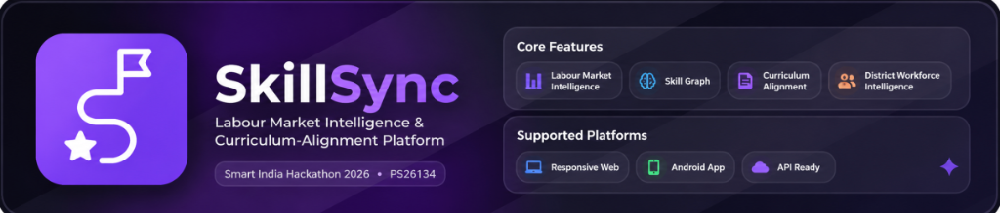

<p align="center">
  
</p>

<p align="center">
  <strong>SkillSync — Labour Market Intelligence & Curriculum-Alignment Platform</strong>
</p>

<p align="center">
  Smart India Hackathon 2026 · Problem Statement PS26134
</p>

## 💡 Proposed Solution

SkillSync is a Labour Market Intelligence & Curriculum-Alignment Platform. It focuses on Maharashtra-first workforce intelligence to address modern skilling gaps by dynamically aligning curriculum with real-time industry demands.

### ✨ Key Features

- **Labour Market Intelligence:** Job and labour-market data ingestion
- **Skill Extraction and Normalization:** Standardizing skill definitions across sectors
- **Maharashtra Skill Graph:** Mapping local employment dynamics
- **Demand/Supply Analysis:** Identifying workforce needs and gaps
- **Curriculum Alignment:** Ensuring educational paths match market reality
- **Obsolete Course Detection:** Identifying outdated training modules
- **District Workforce Intelligence:** Granular regional labor insights
- **Marathi/Hinglish Intelligence:** Multilingual accessibility and contextual understanding
- **Evidence Ledger:** Transparent tracking of skills and certifications
- **Evidence-based Recommendations:** Data-driven learning and hiring matches
- **Human Approval and Governance:** Secure, moderated platform administration
- **NSQF Alignment:** Conforming to National Skills Qualifications Framework
- **Government/Workforce Ecosystem Integration:** Seamless coordination with existing portals

---

## ⚙️ Platforms

| Platform                                                       | Supported? |
| --------------------------------------------------------------- | ----------- |
| Web (any browser with JS functionality) + Fully Responsive       | ✅          |
| Android (non-natively through WebView)                          | ✅          |

## 🚀 Getting Started

### Prerequisites

- Node.js 18+
- Python 3.11
- Docker & Docker Compose
- PostgreSQL (for local development)

### Frontend

```bash
cd web
npm install
npm run dev
```

### Backend

```bash
cd backend
source .venv/bin/activate
pip install -r requirements.txt
uvicorn app.main:app --reload
```

## 🏗️ Tech Stack

### Frontend
- Next.js 15.5.18
- React 19
- TypeScript
- Tailwind CSS
- shadcn/radix

### Backend
- FastAPI
- SQLAlchemy
- PostgreSQL
- Redis
- Celery
- ML & Vector-search components

---

## 👥 Team

**Sahil Kumar**

SkillSync — Smart India Hackathon 2026 · PS26134

## 📊 Repo Stats

<div align="center">
  


</div>

## ⭐ Star History

<a href="https://www.star-history.com/#krsahilkumar2007-boop/skillsync&Date">
 <picture>
   <source media="(prefers-color-scheme: dark)" srcset="https://api.star-history.com/svg?repos=krsahilkumar2007-boop/skillsync&type=Date&theme=dark" />
   <source media="(prefers-color-scheme: light)" srcset="https://api.star-history.com/svg?repos=krsahilkumar2007-boop/skillsync&type=Date" />
   
 </picture>
</a>

## 📄 License

This project is licensed under the **MIT License** - see the [LICENSE](LICENSE) file for details.

- ✅ Commercial use
- ✅ Modification
- ✅ Distribution
- ✅ Private use
- ❌ Liability
- ❌ Warranty

---

## 🏷 Tags  

`#SkillSync` `#SIH2026` `#PS26134` `#LabourMarketIntelligence` `#SkillGraph` `#CurriculumAlignment` `#WorkforceIntelligence` `#NSQF` `#Maharashtra` `#VocationalEducation` `#Skills` `#Employment` `#AI`
